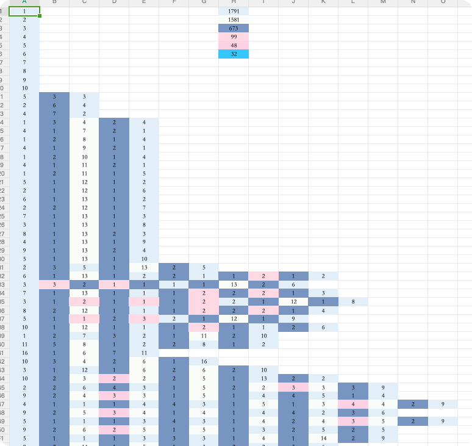

# ColorBlockCrochetCompanion

CrochetPatternAssistant 是一个针对钩织爱好者设计的实用工具，本工具用于处理钩织图案，获取左下到右上的色块排列，并统计不同色块的数量。

## Features

- 自动处理钩织图案，生成左下到右上的色块排列。
- 统计不同色块的数量，帮助您计划所需的线材和颜色。
- 通过excel表格进行输入和输出，方便用户打印结果

## Installation

1. Clone the project repository.

```shell
git clone https://github.com/yourusername/CrochetPatternAssistant.git
```

2. 进行项目目录

```shell
cd CrochetPatternAssistant
```

3. 编译项目

```shell
go build
```

4. 运行

```shell
./ColorBlockCrochetCompanion ./玉桂狗.xlsx
```
程序默认会从指定的Excel的Sheet1工作簿中读入图案数据，然后将结果输出到Sheet3工作簿中。

# Example
---
输入: <br>

---
输出: <br>
